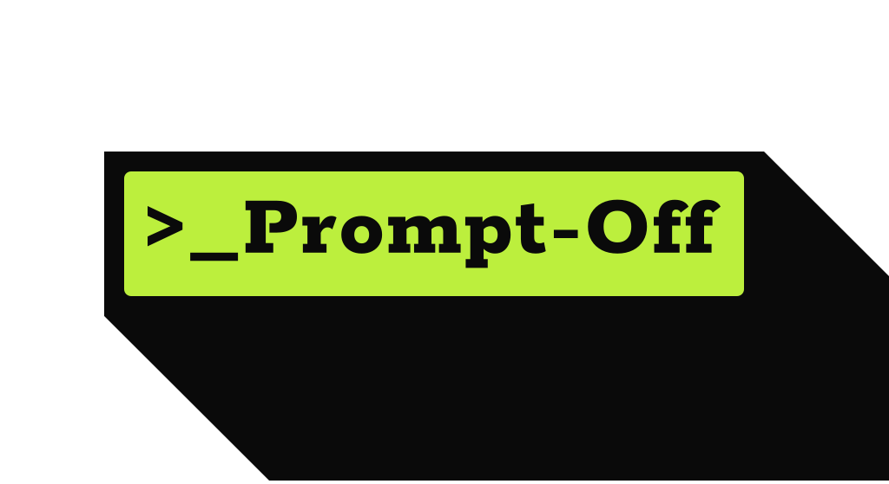

# PromptOff

Competitive multiplayer game where players race to recreate a reference image by writing AI image prompts within a token budget. Up to 8 players per room. Best prompt engineer wins.



---

## How It Works

1. All players see the same reference image
2. Everyone writes a prompt within a token budget (150 tokens default)
3. Prompts are sent to Gemini AI to generate images
4. Generated images are scored against the reference
5. Points awarded across three dimensions — repeat for N rounds

### Scoring

| Dimension | Weight | How |
|-----------|--------|-----|
| Visual Similarity | 60% | Gemini vision compares generated vs. reference (composition, color, subject, style) |
| Prompt Efficiency | 25% | Tokens saved under budget |
| Speed | 15% | Time bonus for faster submissions |

---

## Features

### Gameplay
- **Private rooms** — 6-character code, invite friends
- **1–5 configurable rounds** — host sets round count in lobby
- **Real-time multiplayer** — SpacetimeDB WebSocket subscriptions, no polling
- **Token budget meter** — live counter + chunky progress bar, color-coded safe/warn/danger states
- **Terminal prompt editor** — `>_` prefix, blinking cursor, token cost readout
- **Countdown timer** — per-round time limit with warn/danger color states
- **Results reveal** — per-player card view, similarity %, image comparison (target vs. generated)
- **Score breakdown** — Match / Efficiency / Speed shown separately per round

### Powerups
Six powerup types assignable per player per game:

| Powerup | Type | Effect |
|---------|------|--------|
| Token Drain | Offensive | Drains opponent's token budget |
| Freeze | Offensive | Freezes opponent's input for N seconds |
| Token Shield | Defensive | Blocks one incoming attack |
| Hint | Utility | Reveals keyword hints about the reference image |
| Double Points | Utility | 2× score multiplier for the round |
| Category Reveal | Utility | Reveals the image category |

### Profiles & Stats
- **SpacetimeAuth login** — stable identity across sessions and devices via OIDC
- **User profiles** — display name + avatar, editable from profile page
- **Game stats** — games played, win rate, best score, avg similarity
- **Game history** — recent matches with rank, score, and similarity
- **AI insights** — Gemini-powered coaching (strengths, weaknesses, improvement tips) unlocked after 5 games

### Design
- **Arcade Terminal** design language — Archivo 900 display, Space Mono terminal, acid-lime (`#B8EA38`) accent on ink (`#0E0E08`)
- **Hard-offset shadows** — zero-blur, pixel-precise
- **Floating bottom nav** — Play / Rank / Stats / Profile
- **Global leaderboard** — all-time wins ranking across all players

---

## Tech Stack

| Layer | Technology |
|-------|-----------|
| Frontend | Next.js 16, React 19, TypeScript |
| Backend | SpacetimeDB TypeScript module (runs as WASM) |
| AI | Google Gemini 2.5 Flash (image generation + vision scoring) |
| Auth | SpacetimeAuth (OIDC) via `react-oidc-context` |
| Realtime | SpacetimeDB WebSocket subscriptions |

---

## Running Locally

```bash
# Quick start — kills existing processes, rebuilds + republishes server module,
# regenerates bindings, starts Next.js on port 3001
./dev.sh
```

Open http://localhost:3001

**Manual steps:**

```bash
# 1. Copy env and fill in keys
cp .env.example .env.local

# 2. Start SpacetimeDB local server (binds to port 3000)
spacetime start

# 3. Build and publish server module
cd server && spacetime publish prompter-hack --server local --yes && cd ..

# 4. Regenerate TypeScript bindings after any schema change
npm run stdb:generate

# 5. Start Next.js on port 3001
npm run dev -- --port 3001
```

### Environment Variables

| Variable | Description |
|----------|-------------|
| `GEMINI_API_KEY` | Google Gemini API key |
| `NEXT_PUBLIC_SPACETIMEDB_URL` | `ws://localhost:3000` (local) or `wss://maincloud.spacetimedb.com` (prod) |
| `NEXT_PUBLIC_SPACETIMEDB_MODULE` | Database name (default: `prompter-hack`) |
| `NEXT_PUBLIC_SPACETIMEAUTH_AUTHORITY` | OIDC issuer (`https://auth.spacetimedb.com/oidc`) |
| `NEXT_PUBLIC_SPACETIMEAUTH_CLIENT_ID` | SpacetimeAuth client ID |

### Useful Debug Commands

```bash
spacetime logs prompter-hack -f                  # Tail server logs
spacetime sql prompter-hack "SELECT * FROM room" # Query any table
npm run lint                                     # ESLint
npm run build                                    # Production build check
```

---

## Project Structure

```
src/
  app/
    page.tsx                  # Landing page (create/join room)
    room/[code]/page.tsx      # Game room — all phases
    leaderboard/page.tsx      # Global leaderboard
    stats/page.tsx            # Personal stats + history
    profile/page.tsx          # Profile settings
    api/
      generate-image/         # Gemini image generation
      score-image/            # Gemini vision scoring
      insights/               # Gemini AI coaching
  components/
    PromptEditor.tsx          # Token meter + terminal textarea
    PlayerList.tsx            # Lobby player rows
    ResultsReveal.tsx         # Per-player result cards
    Leaderboard.tsx           # In-game leaderboard
    CountdownTimer.tsx        # Round timer badge
    StatCard.tsx              # Stats summary card
    InsightsPanel.tsx         # AI coaching panel
    BottomNav.tsx             # Floating navigation bar
    ThemeToggle.tsx           # Light/dark toggle (unused)
  hooks/
    useGameSocket.ts          # Shared game types + powerup defs
    useProfile.ts             # User profile subscription
    useStats.ts               # Stats + history subscription
    useInsights.ts            # AI insights hook
    useTheme.ts               # Theme persistence
  lib/
    spacetimedb.ts            # Singleton DB connection
server/
  spacetimedb/src/index.ts    # All reducers and table definitions
public/
  logo.svg                    # Wordmark
  reference-images/           # 20 curated reference images (img-001–img-020)
```

---

## Architecture Notes

- **No separate API server** — application logic runs inside SpacetimeDB as WASM
- **Reducers don't return data** — all state read via table subscriptions
- **Reducers are deterministic** — no network/timers/random inside; use `ctx.timestamp` and `ctx.random()`
- **`ctx.sender` is identity** — never trust identity passed as arguments
- After any schema change: `stdb:build` → `stdb:publish` → `stdb:generate`

### Game Phases

```
disconnected → lobby → countdown → playing → scoring → reveal → leaderboard
```
